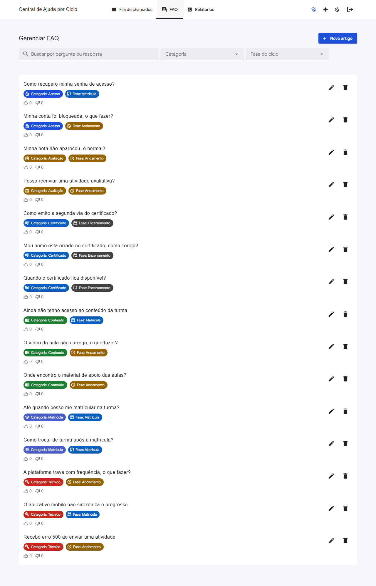
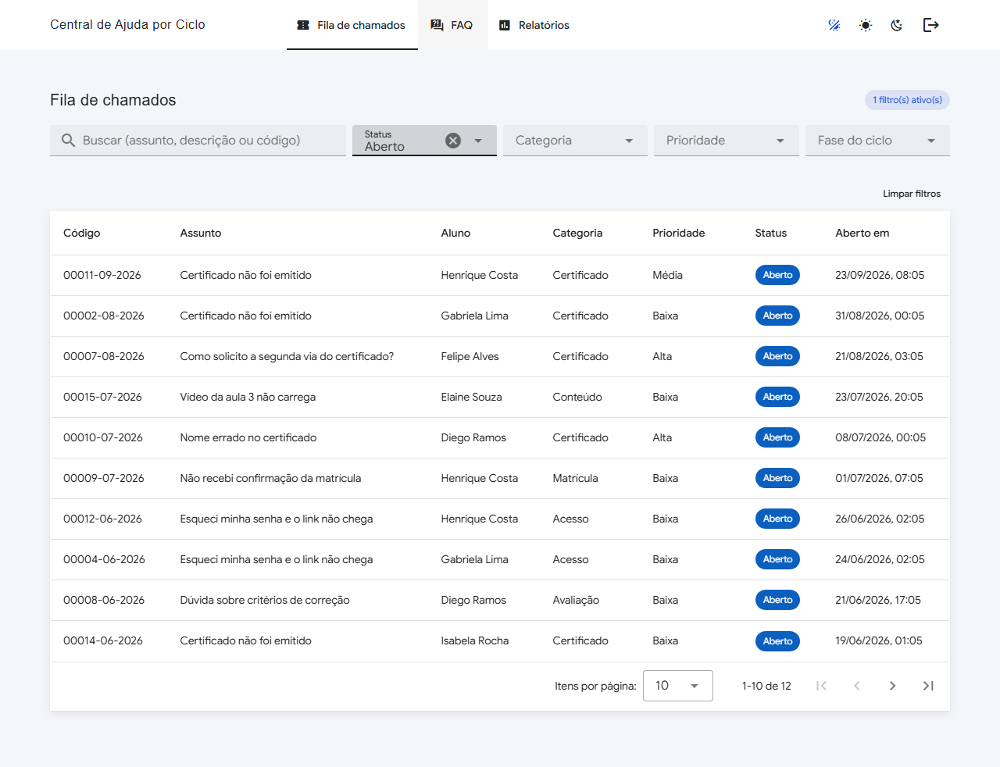
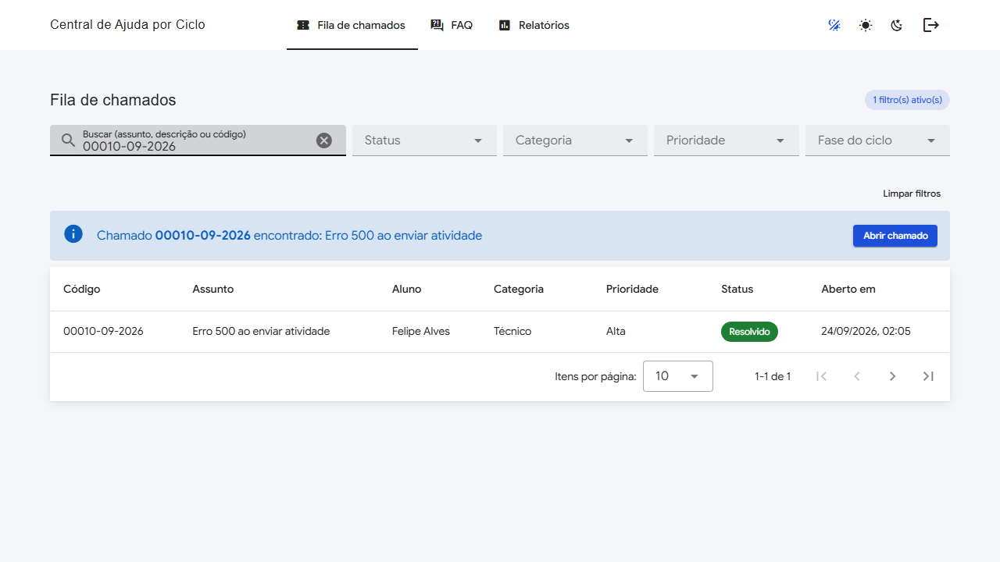
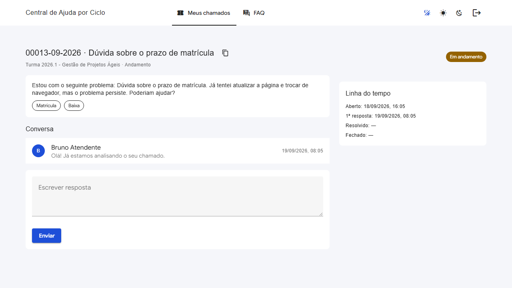
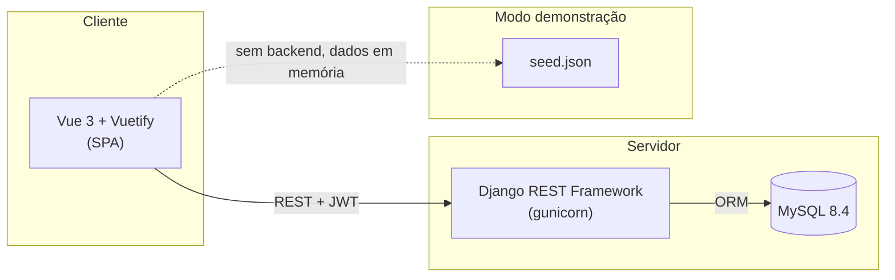
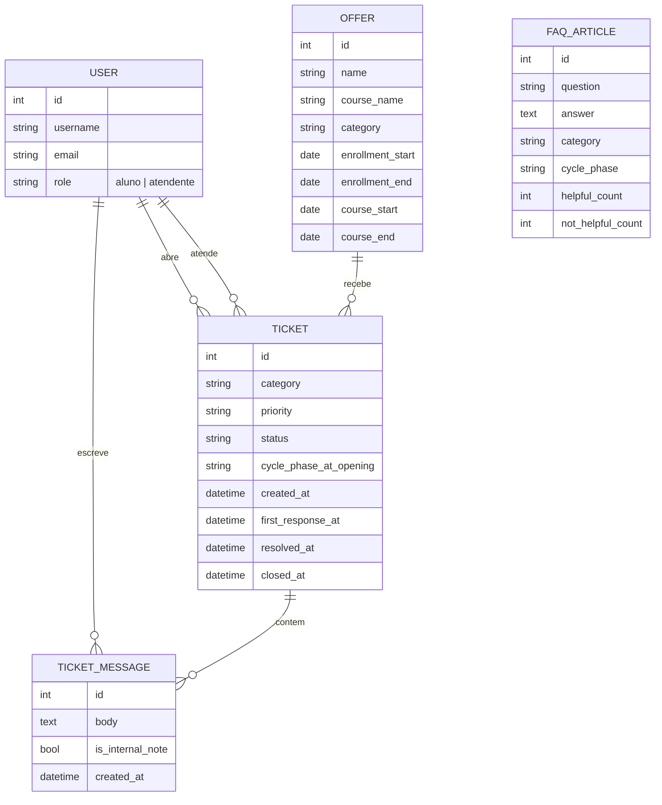
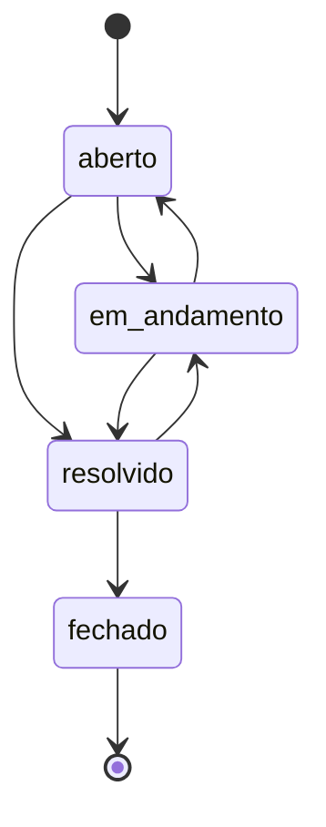

# Central de Ajuda por Ciclo

[](https://github.com/shongasbarbosa/projeto-03-central-ajuda-ciclo/actions/workflows/ci.yml)
[](https://github.com/shongasbarbosa/projeto-03-central-ajuda-ciclo/actions/workflows/deploy.yml)
[](https://shongasbarbosa.github.io/projeto-03-central-ajuda-ciclo/)

Sistema de suporte ao aluno para plataformas de EaD, organizado pelas fases
do ciclo de uma oferta (matrícula, andamento e encerramento). Terceiro de
uma série de cinco projetos de portfólio voltados a um edital de
Desenvolvedor Web para um ambiente EaD baseado em Moodle.

- **Demonstração:** https://shongasbarbosa.github.io/projeto-03-central-ajuda-ciclo/
- **Repositório:** https://github.com/shongasbarbosa/projeto-03-central-ajuda-ciclo

## Objetivo

Oferecer à equipe de suporte de uma plataforma EaD uma central que
concentra a abertura e o atendimento de chamados, uma FAQ contextual capaz
de reduzir tickets repetidos, e relatórios de volume e tempo de resolução
segmentados pela fase do ciclo da oferta — a mesma regra de fase usada no
[projeto 1 (Vitrine de Ofertas)](https://github.com/shongasbarbosa/projeto-01-vitrine-ofertas-ead).

## Problema

Em plataformas EaD, os chamados de suporte se concentram em janelas
específicas do ciclo de uma oferta: picos de dúvidas sobre acesso e
matrícula no início, dúvidas sobre conteúdo e avaliação durante o curso, e
uma onda de pedidos sobre certificado no encerramento. Sem visibilidade por
fase, a equipe de suporte não consegue se planejar, e alunos abrem tickets
para perguntas que já têm resposta pronta na FAQ.

## Funcionalidades por perfil

### Aluno

- Login (com atalhos de demonstração)
- Abertura de chamado em etapas: escolhe a oferta, categoriza e descreve o
  problema, e recebe sugestões de artigos da FAQ antes de enviar
- Ao abrir um chamado, recebe um código de protocolo (`NNNNN-MM-AAAA`) que
  pode copiar com um clique e usar depois para localizar o chamado
- Acompanhamento dos próprios chamados, com busca por assunto, descrição ou
  código de protocolo — os filtros aplicados persistem na URL
- FAQ pesquisável com feedback de "útil" / "não útil", com filtros por
  categoria e fase do ciclo que também persistem na URL

### Atendente

- Fila de chamados com filtros por status, categoria, prioridade, fase do
  ciclo e busca por assunto, descrição ou código de protocolo, com coluna de
  código ordenável cronologicamente
- Todos os filtros, a busca, a ordenação e a página atual persistem na URL
  (sobrevivem a navegação, volta do navegador e recarregamento da página) e
  podem ser limpos com um clique em "Limpar filtros"
- Atribuição de chamados a si mesmo, resposta, notas internas (não
  visíveis ao aluno) e mudança de status/prioridade com transições
  validadas
- Gestão da FAQ (criação, edição, publicação e exclusão de artigos), também
  com filtros persistentes na URL
- Painel de relatórios: volume de chamados por fase do ciclo, tempo médio
  de resolução por categoria e resumo por status

## Capturas de tela

Todas capturadas no modo demonstração (Playwright, `npm run screenshots`).

| Login | Abertura de chamado com sugestões de FAQ |
| --- | --- |
|  |  |

| Detalhe do chamado (aluno) | Fila do atendente |
| --- | --- |
|  |  |

| Detalhe do chamado com nota interna (atendente) | FAQ |
| --- | --- |
|  |  |

| Relatórios — tema claro | Relatórios — tema escuro |
| --- | --- |
|  |  |

| Mobile (360px) |
| --- |
|  |

| Gestão da FAQ (atendente) |
| --- |
|  |

| Fila do atendente com filtros ativos | Busca por código de protocolo |
| --- | --- |
|  |  |

| Detalhe do chamado com código de protocolo |
| --- |
|  |

## Stack

**Backend:** Python 3.13, Django 5.2 LTS, Django REST Framework,
djangorestframework-simplejwt, drf-spectacular, django-filter,
django-cors-headers, django-environ, PyMySQL, MySQL 8.4, gunicorn, ruff,
pytest-django.

**Frontend:** Vue 3 (Composition API) + TypeScript estrito, Vite,
Vuetify 3, Pinia, Vue Router (hash history), ECharts, Vitest, Playwright.

**Infra:** Docker, Docker Compose, GitHub Actions, GitHub Pages.

## Decisões técnicas

- **Driver MySQL: PyMySQL, não mysqlclient.** PyMySQL é puro Python — não
  exige toolchain de compilação nem bibliotecas nativas do MySQL instaladas
  na máquina de desenvolvimento (relevante especialmente no Windows nativo,
  sem WSL) nem no estágio de build da imagem Docker, que fica mais simples
  e rápida. O desempenho é equivalente para a carga de uma aplicação de
  portfólio, e o `pymysql.install_as_MySQLdb()` faz o driver ser usado de
  forma transparente pelo backend MySQL do Django.
- **SimpleJWT para autenticação.** Endpoints stateless com access/refresh
  token, adequados para consumo por uma SPA e para o modo demonstração do
  frontend (que simula os mesmos tokens em memória).
- **drf-spectacular para documentação da API.** Gera o schema OpenAPI a
  partir do próprio código (serializers, views, permissions), evitando que
  a documentação do Swagger (`/api/docs`) e do ReDoc (`/api/redoc`) fique
  dessincronizada da implementação.
- **Google Sans autohospedada via `@fontsource/google-sans`.** Distribuída
  sob a SIL Open Font License; hospedar os arquivos de fonte localmente
  evita dependência de um CDN externo e permite carregar só os pesos
  400/500/600/700 do subset latin.
- **Contador dedicado (`TicketCodeCounter`) com `select_for_update()` para
  o código do chamado**, em vez de derivar o sequencial de um `COUNT` ou do
  próprio `id`. Um `COUNT` por mês teria condição de corrida sob
  concorrência (duas requisições simultâneas podem ler a mesma contagem
  antes de qualquer uma delas inserir sua linha), e o `id` autoincremento
  não reinicia por mês nem é estável se um chamado for excluído. A tabela
  de contador isolada, com uma linha por mês/ano bloqueada por
  `select_for_update()` dentro de uma transação curta, serializa apenas o
  incremento do sequencial — ver a seção "Código de protocolo do chamado".
- **`cycle_phase_at_opening` gravado na abertura do chamado.** A fase do
  ciclo de uma oferta muda com o tempo (matrícula → andamento →
  encerramento). Se o relatório recalculasse a fase a partir da data atual,
  o número de chamados "abertos na matrícula" de uma oferta antiga mudaria
  conforme os meses passassem. Gravar a fase vigente no momento da abertura
  torna os relatórios históricos estáveis.

## Arquitetura



Em produção (Docker), o nginx do container `frontend` serve os arquivos
estáticos da SPA e faz proxy reverso de `/api` para o container `api`. No
GitHub Pages, a SPA é publicada em modo demonstração, sem backend.

## Modelo de dados



## Regra de fase do ciclo

A mesma regra do projeto 1, implementada tanto no backend
(`backend/offers/cycle_phase.py`) quanto no frontend
(`frontend/src/utils/cyclePhase.ts`), com testes automatizados dos dois
lados:

| Fase          | Condição                                              |
| ------------- | ------------------------------------------------------ |
| `matricula`   | até `enrollment_end` (inclusive)                        |
| `andamento`   | entre `enrollment_end` (exclusive) e `course_end` (incl.) |
| `encerramento`| após `course_end`                                       |

## Matriz de permissões

| Ação                                    | Aluno            | Atendente |
| ---------------------------------------- | ---------------- | --------- |
| Abrir chamado                            | ✅ (próprio)      | —         |
| Ver chamado                              | ✅ (só os próprios) | ✅ (todos) |
| Ver notas internas                       | ❌                | ✅        |
| Responder chamado                        | ✅ (próprio)      | ✅        |
| Criar nota interna                       | ❌                | ✅        |
| Mudar status / prioridade / atribuição   | ❌                | ✅        |
| Gerenciar FAQ (criar/editar/excluir)     | ❌                | ✅        |
| Dar feedback em artigo da FAQ            | ✅                | ✅        |
| Ver relatórios                           | ❌                | ✅        |

O chamado de outro aluno não aparece como "acesso negado" (403): a API e o
modo demonstração retornam **404** ("Chamado não encontrado") tanto em
`GET` quanto em `PATCH` e nas mensagens (`/api/tickets/{id}/messages`), sem
distinguir "não existe" de "existe, mas não é seu" — o mesmo vale para
buscas por código de protocolo (ver seção acima). Isso é feito restringindo
o queryset por autor para alunos *antes* de qualquer checagem de permissão
de objeto, para que o aluno nunca receba uma resposta que confirme a
existência do chamado de outra pessoa.

## Transições de status



Não é permitido fechar um chamado sem antes resolvê-lo — a validação é
feita no backend (`Ticket.transition_to`) e replicada no frontend
(`canTransitionTo`), inclusive no modo demonstração.

## Código de protocolo do chamado

Todo chamado recebe, na abertura, um código no formato **`NNNNN-MM-AAAA`**
(sequencial de 5 dígitos, mês e ano), por exemplo `00042-09-2026`.

- O sequencial reinicia em `00001` a cada mês e é único dentro do mês; mês e
  ano são calculados no fuso `America/Sao_Paulo`, então um chamado aberto às
  23h de 30/09 no horário de Brasília recebe o código de setembro mesmo que,
  em UTC, já seja outro dia.
- **Geração livre de duplicidade sob concorrência:** o sequencial é
  controlado por uma tabela dedicada (`TicketCodeCounter`, uma linha por
  mês/ano) atualizada dentro de uma transação com
  `select_for_update()`. Isso serializa apenas o incremento do contador
  (uma operação muito rápida), sem travar a tabela de chamados inteira, e
  garante que dois chamados abertos ao mesmo tempo nunca recebam o mesmo
  código — coberto por um teste automatizado que dispara 15 threads
  simultâneas. No primeiro chamado de um mês novo (quando a linha do
  contador ainda não existe), duas transações podem competir para criá-la
  ao mesmo tempo; `generate_ticket_code` detecta esse `IntegrityError` de
  corrida e tenta de novo em uma transação nova, coberto por um teste
  dedicado a esse cenário.
- **Podem existir lacunas na numeração** (ex.: `00007` seguido de
  `00009`, sem o `00008`): isso é intencional. O contador nunca é
  decrementado — um chamado que falha para criar por outro motivo depois
  de já ter consumido um sequencial, ou uma tentativa de retentativa sob
  concorrência, não "devolve" o número. Priorizar nunca duplicar um
  código (o que quebraria a busca e a identificação do chamado) é mais
  importante do que uma numeração sem nenhuma lacuna.
- Chamados existentes antes desta funcionalidade foram migrados por uma
  migration de dados que atribui os códigos em ordem cronológica de
  abertura, mês a mês.
- O código aparece na lista "Meus chamados", na fila do atendente (coluna
  ordenável cronologicamente, não alfabeticamente — `00001-10-2026` é
  posterior a `00042-09-2026`), no título do detalhe do chamado (com botão
  "Copiar código"), no aviso de sucesso ao abrir um chamado, no
  assunto/corpo do e-mail de mudança de status e no Django Admin.
- **Busca por código:** o mesmo campo de busca aceita várias formas de
  digitar o código, com ou sem zeros à esquerda e usando `-`, `/` ou espaço
  como separador:
  - código completo: `00042-09-2026`, `42/9/2026`, `42 9 2026`
  - sequencial + mês (todos os anos): `00042-09`, `42/9`
  - só o sequencial (todos os meses/anos): `42`, `#42`
  - uma correspondência exata (sequencial + mês + ano) é destacada com um
    atalho para abrir o chamado diretamente
  - um aluno nunca encontra, por código ou qualquer outra busca, um chamado
    de outro aluno — a busca resulta em lista vazia, sem revelar se o
    código existe.

## Filtros persistentes entre telas

Nas quatro telas com listas filtráveis (fila do atendente, "Meus
chamados", FAQ do aluno e gestão de FAQ), o estado dos filtros — busca,
seletores, ordenação, página e itens por página — fica na query string da
própria rota (por exemplo,
`#/atendente/fila?q=00042-09-2026&status=aberto&page=2`), sincronizado nos
dois sentidos com `router.replace` (sem poluir o histórico do navegador a
cada tecla digitada). Isso significa que:

- sair da tela (por exemplo, abrir um chamado) e voltar mantém os mesmos
  filtros, ordenação e página;
- recarregar a página (F5) mantém o estado, porque ele vive na URL;
- a URL com filtros aplicados pode ser copiada e compartilhada;
- valores inválidos na URL (um status inexistente, por exemplo) são
  ignorados silenciosamente, sem quebrar a tela;
- os filtros só são limpos quando o campo é esvaziado, pelo "X" de cada
  campo ou pelo botão "Limpar filtros" (visível apenas quando há algum
  filtro ativo, ao lado de um indicador com a quantidade de filtros
  ativos);
- ao fazer logout, nenhum filtro fica retido para a próxima sessão.

A URL sozinha resolve o botão "voltar" do navegador, mas não a navegação
pelo menu: sair pela aba "FAQ" e clicar de novo em "Fila de chamados" abre
a rota do zero, sem query alguma. Por isso a última query de cada lista
também é guardada em um **store Pinia persistido em `sessionStorage`**
(`useListFiltersStore`), isolado por id de usuário — a sessão demo troca de
perfil sem recarregar a página, e os filtros de um perfil não devem
aparecer para o próximo login. Ao entrar em uma dessas rotas sem query, a
última query salva é restaurada via `router.replace`; se a rota já chega
com algum parâmetro de filtro (link compartilhado ou "voltar" do
navegador), a URL tem prioridade sobre o valor salvo. Tudo é limpo no
logout. A lógica comum às quatro telas (ler/restaurar da URL ou do store,
sincronizar de volta, contar filtros ativos, limpar) está no composable
`frontend/src/composables/useListFilters.ts`, reutilizado por todas elas
em vez de duplicado.

## Endpoints da API

Documentação interativa completa em `/api/docs` (Swagger) e `/api/redoc`
(ReDoc) quando o backend está no ar.

| Método | Endpoint                              | Descrição                                   |
| ------ | -------------------------------------- | -------------------------------------------- |
| POST   | `/api/auth/login`                      | Autentica e retorna tokens JWT               |
| POST   | `/api/auth/refresh`                    | Renova o access token                        |
| GET    | `/api/auth/me`                         | Dados do usuário autenticado                 |
| GET    | `/api/offers`                          | Lista ofertas com `cycle_phase` calculada    |
| GET    | `/api/tickets`                         | Lista chamados (filtros, ordenação e busca por assunto/descrição/código) |
| POST   | `/api/tickets`                         | Abre um novo chamado                         |
| GET    | `/api/tickets/{id}`                    | Detalhe do chamado                           |
| PATCH  | `/api/tickets/{id}`                    | Atualiza status/prioridade/atribuição (atendente) |
| GET    | `/api/tickets/{id}/messages`           | Lista mensagens do chamado                   |
| POST   | `/api/tickets/{id}/messages`           | Envia mensagem ou nota interna               |
| GET    | `/api/faq`                             | Lista artigos publicados (com filtros)       |
| POST   | `/api/faq`                             | Cria artigo (atendente)                      |
| PATCH  | `/api/faq/{id}`                        | Edita artigo (atendente)                     |
| DELETE | `/api/faq/{id}`                        | Remove artigo (atendente)                    |
| GET    | `/api/faq/suggestions`                 | Sugestões de FAQ por texto/oferta            |
| POST   | `/api/faq/{id}/feedback`               | Registra feedback útil/não útil              |
| GET    | `/api/reports/tickets-by-cycle-phase`  | Volume e tempo médio por fase do ciclo       |
| GET    | `/api/reports/tickets-by-priority`     | Volume de chamados por prioridade            |
| GET    | `/api/reports/avg-resolution-time`     | Tempo médio de resolução por categoria       |
| GET    | `/api/reports/summary`                 | Totais por status e tempos médios            |
| GET    | `/api/health`                          | Healthcheck                                  |

Exemplos com curl:

```bash
# Login
curl -X POST http://localhost:8000/api/auth/login \
  -H "Content-Type: application/json" \
  -d '{"username": "aluno.demo", "password": "aluno12345"}'

# Listar ofertas (autenticado)
curl http://localhost:8000/api/offers \
  -H "Authorization: Bearer <access_token>"

# Abrir um chamado
curl -X POST http://localhost:8000/api/tickets \
  -H "Authorization: Bearer <access_token>" \
  -H "Content-Type: application/json" \
  -d '{"offer": 1, "category": "acesso", "priority": "media", "subject": "Não consigo acessar", "description": "Detalhes do problema."}'

# Sugestões de FAQ antes de abrir um chamado
curl "http://localhost:8000/api/faq/suggestions?query=senha&offer=1" \
  -H "Authorization: Bearer <access_token>"

# Relatório de chamados por fase do ciclo (atendente)
curl http://localhost:8000/api/reports/tickets-by-cycle-phase \
  -H "Authorization: Bearer <access_token_atendente>"
```

## Como rodar com Docker

Pré-requisitos: Docker e Docker Compose.

```bash
cp .env.example .env
docker compose up --build
```

- Frontend: http://localhost:8080
- API: http://localhost:8000/api (Swagger em `/api/docs`)
- MySQL: porta 3306 do host (ajuste `MYSQL_HOST_PORT` no `.env` se a porta
  já estiver em uso, por exemplo por um MySQL/PostgreSQL nativo)

O container `api` aplica as migrations, coleta os arquivos estáticos e
executa o `seed_demo` automaticamente antes de subir o gunicorn (esse
comportamento pode ser desativado com `SEED_DEMO_DATA=false` no `.env`).
O comando aceita `--export-path <arquivo>` para exportar o `seed.json` em
outro local e `--no-export` para pular a exportação por completo — é assim
que os testes automatizados evitam sobrescrever o `seed.json` versionado.

Credenciais de demonstração (também usadas pelo `seed_demo`):

| Perfil     | Usuário            | Senha             |
| ---------- | ------------------- | ------------------ |
| Aluno      | `aluno.demo`         | `aluno12345`        |
| Atendente  | `atendente.demo`     | `atendente12345`    |

Para encerrar e remover os volumes (banco de dados incluído):

```bash
docker compose down -v
```

## Desenvolvimento local sem Docker

**Backend:**

```bash
cd backend
python -m venv .venv
.venv\Scripts\activate  # Windows
pip install -r requirements-dev.txt
python manage.py migrate
python manage.py seed_demo
python manage.py runserver
```

Requer um MySQL 8.4 acessível localmente (ajuste as variáveis `MYSQL_*` no
`.env`, copiado de `.env.example`).

**Frontend:**

```bash
cd frontend
npm install
npm run dev
```

Use `VITE_DEMO_MODE=true` no `.env` do frontend para rodar sem backend, com
dados fictícios do `seed.json`.

## Qualidade e testes

**Backend** (`cd backend`):

```bash
ruff check .
pytest -v
```

98 testes cobrindo a regra de fase do ciclo, transições de status,
permissões por papel (incluindo um aluno tentando acessar o chamado de
outro aluno — 404, não 403, em `GET`, `PATCH` e mensagens — e ver notas
internas ou o código de outro aluno), geração e busca do código de
protocolo (formato, reinício mensal, limite de fuso horário em
`America/Sao_Paulo`, concorrência com 15 threads simultâneas incluindo o
primeiro chamado de um mês novo, e todas as variações de busca), a
migration de dados que preenche o código dos chamados antigos (testada de
verdade com `MigrationExecutor`: volta o banco para o estado anterior à
migration, cria chamados sem código em meses diferentes, aplica a
migration e confere código/ordem/contadores resultantes — não apenas a
função pura de cálculo do sequencial), ordem cronológica dos códigos
gerados pelo `seed_demo`, sugestões de FAQ, relatórios (incluindo a ordem
fixa e o total zero do relatório por prioridade) e idempotência do
`seed_demo`. Os testes rodam contra um MySQL real (nunca SQLite).

**Frontend** (`cd frontend`):

```bash
npm run lint
npx vue-tsc -b
npm run test:unit      # Vitest — 80 testes
npm run build
```

**Testes e2e** (Playwright, `cd frontend`):

```bash
npm run test:e2e                              # modo demonstração
docker compose up -d                          # a partir da raiz do projeto
PLAYWRIGHT_REAL_API=true npm run test:e2e:real  # contra a API real
```

Cobrem login como aluno e como atendente, abertura de chamado, bloqueio de
telas do atendente para o aluno e logout, geração/cópia/busca do código de
protocolo (incluindo busca só pelo número retornando chamados de meses
diferentes) e persistência de filtros (navegação com o botão "voltar" do
navegador, navegação pelo menu entre abas, recarregamento e limpeza) —
tanto no modo demonstração quanto contra a API real servida pelo Docker.

Há também `npm run test:e2e:published`, que roda contra o site já publicado
no GitHub Pages (login como aluno e atendente, persistência de tema,
recarregamento de rota interna e logout).

**Screenshots** (Playwright, modo demonstração):

```bash
npm run screenshots
```

Gera as imagens em `docs/screenshots/` (login, abertura de chamado com
sugestões de FAQ, detalhe do chamado nas duas visões, fila do atendente,
relatórios nos dois temas, FAQ e a tela em 360px).

## CI/CD

- **CI** (`.github/workflows/ci.yml`): em todo push e pull request para
  `main`, roda `ruff`, `manage.py makemigrations --check --dry-run`,
  `manage.py spectacular --validate --fail-on-warn` e `pytest` (com um
  MySQL 8.4 como service container) para o backend, e `eslint`, `vue-tsc`,
  `vitest` e `vite build` para o frontend.
- **Deploy** (`.github/workflows/deploy.yml`): em todo push para `main`,
  builda o frontend em modo demonstração (`VITE_DEMO_MODE=true`) com o
  `base` `/projeto-03-central-ajuda-ciclo/` e publica no GitHub Pages.

## Modo demonstração vs. API real

O frontend implementa a mesma interface de serviço
(`frontend/src/services/types.ts`) em duas versões, escolhidas por
`VITE_DEMO_MODE`:

- **API real** (`services/api`): consome o backend Django via `fetch` e
  JWT, com renovação automática de token em uma resposta 401.
- **Modo demonstração** (`services/demo`): não faz nenhuma chamada de
  rede. Carrega o `seed.json` exportado pelo `seed_demo`, recalcula a fase
  do ciclo das ofertas a partir da data atual, e replica em TypeScript as
  mesmas regras de permissão e de transição de status do backend. Todas as
  alterações (novos chamados, respostas, feedback de FAQ) ficam apenas em
  memória e são perdidas ao recarregar a página — por isso a faixa "Modo
  demonstração: dados fictícios, sem backend" fica sempre visível nesse
  modo.

O site publicado no GitHub Pages roda sempre em modo demonstração, já que
não há backend hospedado para ele consumir.

## Deploy da API

O backend não está hospedado permanentemente neste momento. Para publicá-lo
futuramente em um serviço com plano gratuito (sem custos), o caminho mais
direto é:

1. Escolher um provedor com free tier para containers/apps Python, como
   Render, Railway ou Fly.io.
2. Provisionar um banco MySQL gerenciado compatível com o plano gratuito
   escolhido (ou usar o addon de banco do próprio provedor).
3. Configurar as variáveis de ambiente de produção (`DJANGO_SECRET_KEY`,
   `DJANGO_ALLOWED_HOSTS`, `CORS_ALLOWED_ORIGINS`, `MYSQL_*`), seguindo o
   `.env.example` como referência.
4. Apontar o build para a imagem `backend/Dockerfile` já existente no
   repositório, que já aplica migrations e roda o gunicorn.
5. Atualizar `VITE_API_URL` no build do frontend (ou publicar uma segunda
   versão da SPA fora do modo demonstração) para apontar para a URL pública
   da API.

Nenhuma conta foi criada nem nenhum deploy foi realizado como parte deste
portfólio — esta seção documenta o caminho, não um estado já implantado.

## Competências demonstradas

- Suporte ao usuário: fila de chamados, notas internas, transições de
  status e notificação por e-mail (console backend) ao aluno.
- Relatórios: volume e tempo de resolução segmentados por fase do ciclo e
  por categoria, com gráficos acessíveis (resumo textual ao lado de cada
  gráfico).
- Ciclos de entrada e encerramento de ofertas: regra de fase do ciclo
  compartilhada entre backend e frontend, com a fase gravada no momento da
  abertura do chamado para relatórios históricos estáveis.
- Django REST Framework e Python: apps modulares, permissões por papel,
  filtros, testes com pytest-django contra MySQL real.
- Vue.js/Vuetify: SPA com Composition API, TypeScript estrito, Pinia,
  tema claro/escuro/sistema e acessibilidade (labels, foco visível,
  contraste AA).
- MySQL: schema normalizado, charset utf8mb4, testes e seed contra o banco
  real.
- Documentação de APIs: OpenAPI gerado via drf-spectacular, Swagger e
  ReDoc.
- Docker: Dockerfiles multi-estágio, docker-compose com healthcheck e
  entrypoint idempotente.
- Git: histórico organizado em commits pequenos por área do sistema.

## Autor

**Dhyego Barbosa** — https://github.com/shongasbarbosa
